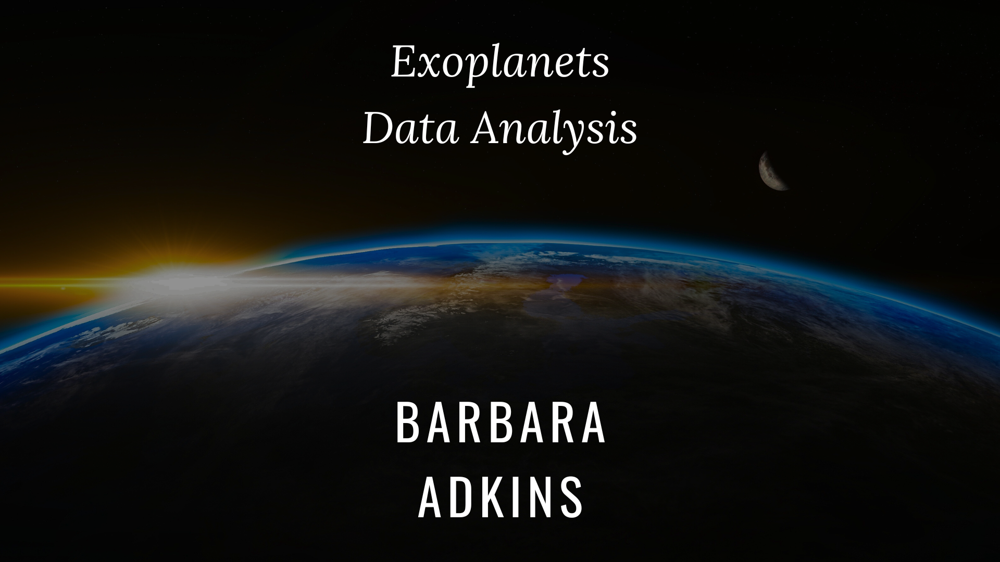

**Welcome to my project!**

You may be asking, “Why Exoplanets?”. I lived in the country when I was younger and street lighting was not common. Therefore, other than clouds, nothing interfered with viewing the part of the Milky Way which was visable from my home. To my young mind this was a magical sight and was the beginning of my love of the stars. 

While there are many realms to explore concerning planets and galaxies, today's focus will be on exoplanets.  Extrasolar Planets are those that orbit a star, that are not in our solar system and therefore outside our stars influence.  Next is a NASA video presentation on Exoplanets. The video will open in a new  window. I have also embedded it within the executable program for convenience.

[NASA video on Exoplanets](https://youtu.be/4IXYp9Fse44 "NASA Video on Exoplanets")

In this project, we will look at how and where Exoplanets have been found. Also, the equipment used and how far each is from Earth. Included in the analysis is comparison of line segments basing values on the radius of Earth, Jupiter and the Sun. 

Below, I have included a data dictionary which explains the abbreviations used as the column titles.

Fun piece of trivia, the letter classification (pl_letter) indicates the order of discovery for planets and for stars it references the size of the star.

**Best practices and how to run the project**

To run this project, first you will need Git and Jupyter Notebook. You can also run the project in Google Colab, but you will need to add the csv files to your local machine.

The instructions for installing Git can be found [here](https://github.com/git-guides/install-git) and the instructions for installing Jupyter Notebook can be found [here](https://docs.jupyter.org/en/latest/install/notebook-classic.html).

Go to my repository: [Capstone Repository](https://github.com/Barleead/Astronomy-capstone) and clone the repository.

My project has nothing in the requirements folder so when running my project you may skip that step.

Open Git and enter the following commands to create a virtual environment:

**Windows**

1. python -m venv venv
2. source venv\bin\activate or source venv\scripts\activate
3. pip install -r requirements.  

**Linux/Mac0S**

1. python3 -m venv venv
2. source venv/bin/activate
3. pip install -r requirements.txt

After the virtual environment is created, enter “git clone” followed by the URL you copied when cloning the repository.

Run the file “Capstone Exoplanets”

To exit the virtual environment type “deactivate”.

**Features**

1) Loading Data: Reading in two CSVs
1) Clean and operate on the data: pandas merge and select specific rows and columns
1) Visualize and present the data: Tableau Dashboard
1) Best Practices: virtual environment and a data dictionary for planet names
1) Interpretation of the data: markdown cells in program and summary in readme.md

**Interpretation of the data**

  There is a great deal of informtion on the internet concerning Exoplanets. The small amount of data I have worked with shows that there are differences in the information presented depending on points of reference: the radius of the Earth and Sun for example..  The source of the data is filtered through other known data and can be approximations.  Please refer to project visualizations at ***(insert tableau link here)***

   **Resources**

   [kaggle.com](kaggle.com)

   [https://eyes.nasa.gov/apps/exo/#/system/K2-17	](https://eyes.nasa.gov/apps/exo/#/system/K2-17)

   <https://exoplanetarchive.ipac.caltech.edu/applications/DocSet/index.html?doctree=/docs/docmenu.xml&startdoc=item_1_01>

   https://wiki.starbase118.net/wiki/index.php/Planetary\_Classification

   http://exoplanetarchive.ipac.caltech.edu/docs/API_PS_columns.html

   **Future Plans**

   Explore the mass of the planets relative to distance.

   Exploration of the distance, in light years, between any two given planets.

   Answer the question, "Does one type of equipment over another, make a difference in how easily a planet could be discovered?"

   Discuss data regarding possibility of life on other planets.

